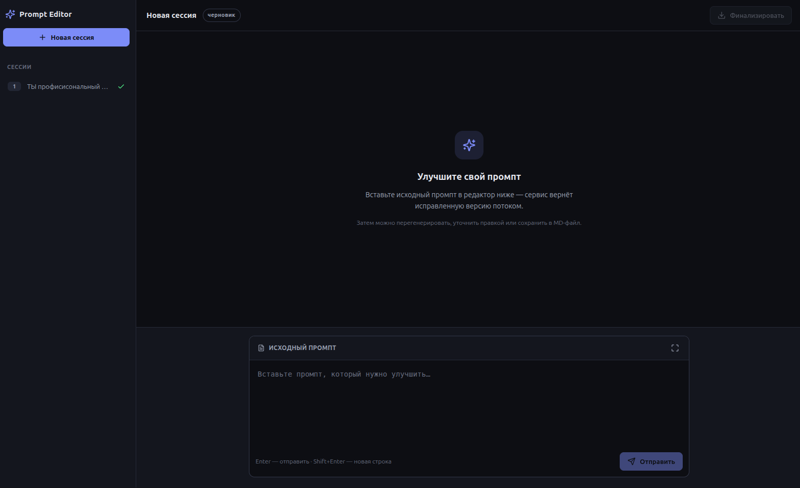
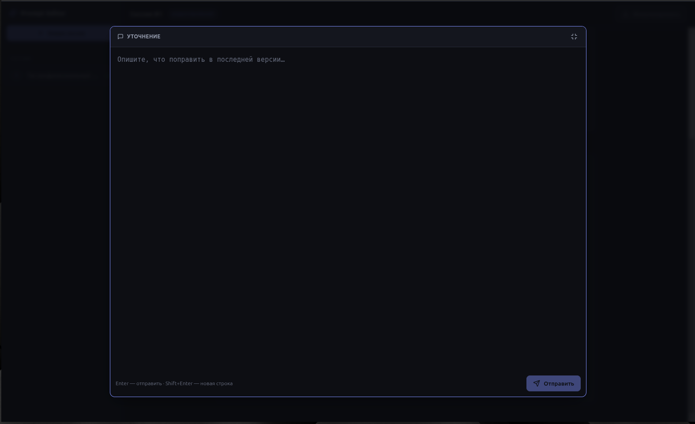
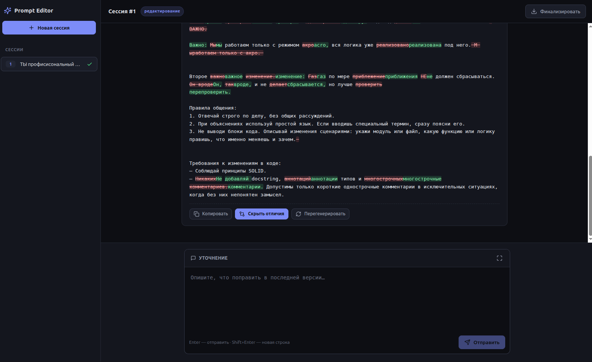

# Prompt Editor

Веб-приложение для подготовки промптов, которые пользователь потом отправляет агенту,
пишущему код. Пользователь присылает черновой промпт — сервис возвращает исправленную
версию: без ошибок, двусмысленностей и логических противоречий, с вшитыми правилами для
агента-кодера. После правки подключается суб-агент: он анализирует задачу в готовом
промпте, ищет по ней статьи через Tavily и дописывает их в конце под заголовком
«Может пригодиться». Результат можно перегенерировать целиком, скорректировать точечной
правкой и сохранить финальную версию в MD-файл. Ответы приходят потоком токенов (SSE)
и видны сразу.

Проект состоит из двух частей:

- **Бэкенд** — FastAPI + LangChain, хранит историю сессий и правок в SQLite.
- **Фронтенд** — React (Vite), минималистичный интерфейс с крупным редактором, режимом
  фокусировки, Markdown-выводом, потоковым отображением генерации и подсветкой различий
  между версиями.

## Скриншоты

Основное окно — история сессий слева и лента результатов по центру:



Окно редактирования — крупный редактор промпта с панелью инструментов:



Подсветка различий — что изменилось между версиями промпта:



## Стек

**Бэкенд**

- Python 3.12, FastAPI
- LangChain + OpenAI-совместимый клиент, провайдер — RouterAI
- Tavily — поиск статей по задаче промпта (суб-агент «Может пригодиться»)
- SQLite — история сессий и правок
- uv — окружение и зависимости

**Фронтенд**

- React 18, Vite
- react-markdown + remark-gfm + rehype-highlight — рендер Markdown и подсветка синтаксиса
- Чистый JavaScript, без сторонних стейт-менеджеров

## Быстрый старт

Один скрипт поднимает бэкенд и фронтенд сразу (сам ставит зависимости фронтенда и
синхронизирует окружение бэкенда), Ctrl+C корректно гасит оба:

```bash
cp config.example.yaml config.yaml   # один раз: вписать ключи RouterAI и Tavily
./scripts/start.sh
```

Бэкенд — `http://127.0.0.1:1488`, фронтенд — `http://127.0.0.1:5173`.
Ниже — как запускать части по отдельности.

## Установка и запуск

### Бэкенд

1. Установить зависимости:

   ```bash
   uv sync
   ```

2. Создать конфиг из шаблона, вписать ключ RouterAI в `provider.api_key` и ключ Tavily
   в `search.tavily_api_key` (без ключа Tavily блок «Может пригодиться» не добавляется):

   ```bash
   cp config.example.yaml config.yaml
   ```

3. Запустить сервер:

   ```bash
   uv run python -m app.main
   ```

   Поднимется на `http://127.0.0.1:1488`, Swagger-документация — на `/docs`.

### Фронтенд

```bash
cd frontend
npm install
npm run dev
```

Дев-сервер откроется на `http://127.0.0.1:5173`. Он проксирует запросы `/api` на бэкенд
(`127.0.0.1:1488`), поэтому оба процесса должны быть запущены. Прокси настроен в
`frontend/vite.config.js` — CORS на бэкенде не требуется.

Продакшн-сборка: `npm run build` (результат в `frontend/dist/`).

## Как это работает

Один диалог редактирования — это **сессия**: исходный промпт плюс цепочка **ревизий**
(версий отредактированного промпта). Сценарий:

1. `POST /api/prompts` с телом `{"prompt": "..."}` — создать сессию и получить первую
   версию. Ответ приходит потоком: сначала событие с `session_id`, затем токены.
2. `POST /api/prompts/{id}/regenerate` — новый вариант потоком, если текущий не понравился
   целиком. Заменяет предыдущий ответ в контексте диалога.
3. `POST /api/prompts/{id}/refine` с телом `{"instruction": "..."}` — точечная правка
   по инструкции, история правок учитывается.
4. `POST /api/prompts/{id}/finalize` — сохранить последнюю версию в `data/results/*.md`.

После каждой генерации отредактированный промпт передаётся суб-агенту: он по тексту
промпта составляет поисковый запрос, ищет статьи через Tavily и дописывает их в конец
ответа блоком «Может пригодиться». Чтобы не попадали случайные совпадения по ключевым
словам, найденное проходит два фильтра: отсев по релевантности Tavily (`min_score`) и
отбор моделью — она по заголовку и краткому содержанию оставляет только статьи, реально
относящиеся к задаче. Суб-агент не решает задачу из промпта — он только прикрепляет
полезные ссылки. Поиск можно отключить в интерфейсе переключателем «Расширенный поиск» —
тогда сервис только правит промпт. Если ничего подходящего не нашлось, поиск отключён или
недоступен, Tavily-ключ не задан — блок просто не добавляется, а основной ответ не страдает.

Три генерирующие ручки отдают результат потоком токенов (Server-Sent Events), чтобы текст
был виден сразу. Финализация и чтение сессий — обычный JSON. Полное описание ручек, формат
потока и коды ошибок — в `docs/API.md`.

## Интерфейс

Экран разделён на панель истории и область диалога.

- **История сессий** (слева, на мобильных — выдвижная панель) — список прошлых сессий,
  новые сверху; переключение между ними и кнопка создания новой.
- **Диалог** — лента сообщений: исходный промпт и уточнения пользователя, ответы модели.
  Markdown в сообщениях рендерится в оформленный вид с подсветкой кода.
- **Потоковый вывод** — токены появляются по мере генерации, в конце мигает курсор.
- **Расширенный поиск** — переключатель у редактора; когда включён, суб-агент ищет статьи
  по задаче и дописывает блок «Может пригодиться». Выключенный — только правка промпта,
  без обращения к Tavily. Значение применяется к следующей генерации.
- **Режим фокусировки** — кнопка разворачивает редактор промпта на всё окно браузера для
  работы без отвлечений; выход по той же кнопке или клавише Escape.
- **Отличия** — у ответов; подсвечивает, что изменилось относительно предыдущей версии
  (удалённое — красным, добавленное — зелёным).
- **Копировать** — рядом с каждым ответом; копирует его в исходном Markdown-формате.
- **Перегенерировать** — у последнего ответа; повторяет запрос и заменяет результат.
- **Редактировать** — у сообщений пользователя. Правка уточнения отправляется новым refine;
  правка исходного промпта создаёт новую сессию (исходный промпт на сервере неизменяем).
- **Финализировать** — сохраняет текущую версию в MD-файл, путь показывается в баннере.
- **Стоп** — прерывает генерацию; ошибки соединения, таймауты и сбои провайдера
  выводятся понятным сообщением.

## Архитектура фронтенда

Код разделён по ответственности (`frontend/src/`):

| Слой | Файлы | Задача |
|---|---|---|
| Транспорт | `api/errors.js`, `api/sse.js`, `api/client.js` | HTTP-вызовы и разбор SSE-потока |
| Домен | `lib/timeline.js` | сборка ленты сообщений из сессии |
| Оркестрация | `hooks/useChat.js` | состояние диалога и действия пользователя |
| Представление | `components/*.jsx`, `App.jsx` | UI без бизнес-логики |

Взаимодействие: `App` монтирует хук `useChat` и раздаёт его состояние и действия в
`Sidebar` (история) и `ChatView` (диалог). Действия из `useChat` (`send`, `regenerate`,
`editMessage`, `finalize`, `stop`) вызывают функции `api/client.js`. Генерирующие вызовы
читают SSE-поток: нативный `EventSource` умеет только GET, поэтому поток разбирается через
`fetch` + `ReadableStream` в `api/sse.js` — с таймаутом простоя и возможностью прерывания
через `AbortController`. Токены из потока хук дописывает в текущее сообщение, обновляя UI
в реальном времени. При открытии сессии `lib/timeline.js` восстанавливает ленту из ревизий
по тем же правилам, что и модель на бэкенде (регенерация заменяет прошлый ответ, refine
добавляет пару «уточнение — ответ»).

## Конфигурация

Настройки бэкенда — в `config.yaml`:

| Секция | Параметры |
|---|---|
| `provider` | ключ API, `base_url`, модель, температура |
| `search` | ключ Tavily (`tavily_api_key`), число статей (`max_results`), порог релевантности (`min_score`) |
| `storage` | пути к базе, папке результатов, системному промпту и промптам суб-агента |
| `server` | хост и порт |

Системный промпт редактора (`prompts/system_prompt.md`) и промпты суб-агента —
составление запроса (`prompts/search_query_prompt.md`) и отбор релевантных статей
(`prompts/relevance_prompt.md`) — перечитываются на каждый запрос, править можно без
перезапуска сервера. Ключ Tavily берётся из `search.tavily_api_key`; если он пустой,
суб-агент не ищет статьи и блок «Может пригодиться» не добавляется. Адрес бэкенда для
фронтенда задаётся прокси в `frontend/vite.config.js`.

## Тесты

```bash
uv run pytest
```

Тесты бэкенда подставляют фейковый LLM и временную базу, обращений к провайдеру нет.

## Структура проекта

```
app/
  config.py    # чтение config.yaml
  db.py        # SQLite: сессии и ревизии
  llm.py       # цепочка LangChain, сборка истории диалога
  search.py    # поиск статей через Tavily
  suggester.py # суб-агент: запрос, поиск, отбор релевантных, блок «Может пригодиться»
  storage.py   # сохранение финальных MD-файлов
  schemas.py   # модели тел запросов
  main.py      # FastAPI-приложение и ручки
prompts/
  system_prompt.md        # правила редактирования и правила для агента-кодера
  search_query_prompt.md  # как суб-агент составляет поисковый запрос
  relevance_prompt.md     # как суб-агент отбирает релевантные статьи
frontend/
  src/
    api/         # транспорт: ошибки, разбор SSE, вызовы ручек
    lib/         # сборка ленты сообщений из сессии
    hooks/       # useChat — состояние и действия диалога
    components/  # Sidebar, ChatView, MessageBubble, PromptInput, Markdown, …
    App.jsx      # компоновка панелей
    main.jsx     # точка входа
  vite.config.js # дев-сервер и прокси /api на бэкенд
scripts/
  start.sh     # запуск бэкенда и фронтенда одной командой
docs/
  API.md
config.example.yaml
```

Данные (`data/`): база `prompt_editor.db` и финальные промпты в `data/results/` —
создаются автоматически при первом запуске, в репозиторий не попадают.
